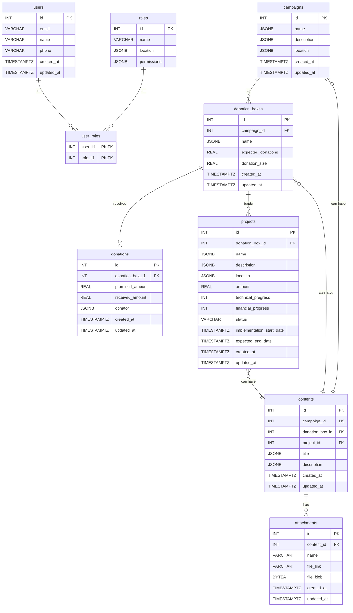

# Database Schema Chart

```mermaid
erDiagram
    users {
        INT id PK
        VARCHAR email
        VARCHAR name
        VARCHAR phone
        TIMESTAMPTZ created_at
        TIMESTAMPTZ updated_at
    }

    roles {
        INT id PK
        VARCHAR name
        JSONB location
        JSONB permissions
    }

    user_roles {
        INT user_id PK, FK
        INT role_id PK, FK
    }

    campaigns {
        INT id PK
        JSONB name
        JSONB description
        JSONB location
        TIMESTAMPTZ created_at
        TIMESTAMPTZ updated_at
    }

    donation_boxes {
        INT id PK
        INT campaign_id FK
        JSONB name
        REAL expected_donations
        REAL donation_size
        TIMESTAMPTZ created_at
        TIMESTAMPTZ updated_at
    }

    donations {
        INT id PK
        INT donation_box_id FK
        REAL promised_amount
        REAL received_amount
        JSONB donator
        TIMESTAMPTZ created_at
        TIMESTAMPTZ updated_at
    }

    projects {
        INT id PK
        INT donation_box_id FK
        JSONB name
        JSONB description
        JSONB location
        REAL amount
        INT technical_progress
        INT financial_progress
        VARCHAR status
        TIMESTAMPTZ implementation_start_date
        TIMESTAMPTZ expected_end_date
        TIMESTAMPTZ created_at
        TIMESTAMPTZ updated_at
    }

    contents {
        INT id PK
        INT campaign_id FK
        INT donation_box_id FK
        INT project_id FK
        JSONB title
        JSONB description
        TIMESTAMPTZ created_at
        TIMESTAMPTZ updated_at
    }

    attachments {
        INT id PK
        INT content_id FK
        VARCHAR name
        VARCHAR file_link
        BYTEA file_blob
        TIMESTAMPTZ created_at
        TIMESTAMPTZ updated_at
    }

    users ||--o{ user_roles : "has"
    roles ||--o{ user_roles : "has"
    campaigns ||--o{ donation_boxes : "has"
    donation_boxes ||--o{ donations : "receives"
    donation_boxes ||--o{ projects : "funds"
    campaigns }o--|| contents : "can have"
    donation_boxes }o--|| contents : "can have"
    projects }o--|| contents : "can have"
    contents ||--o{ attachments : "has"
```
